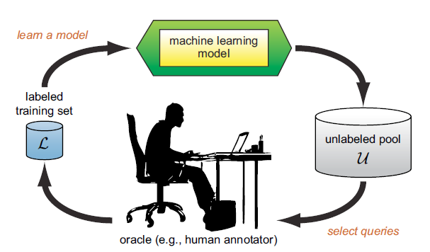
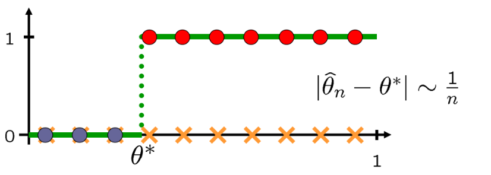
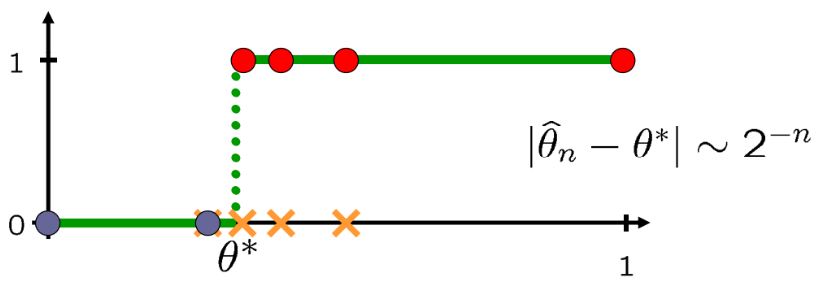
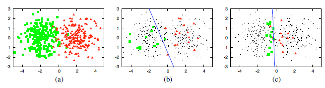
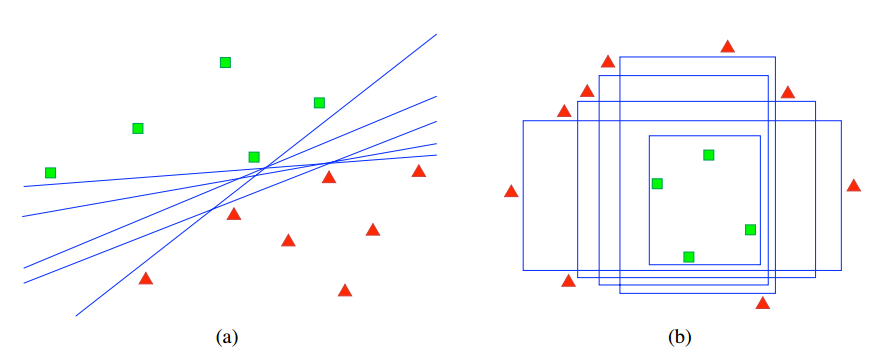
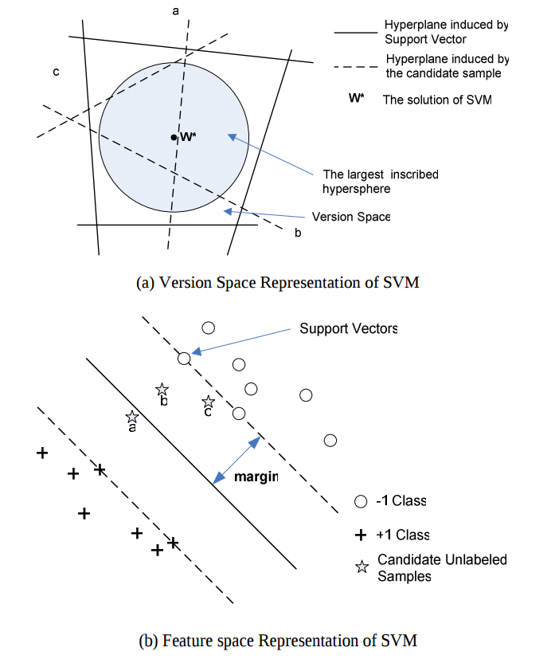
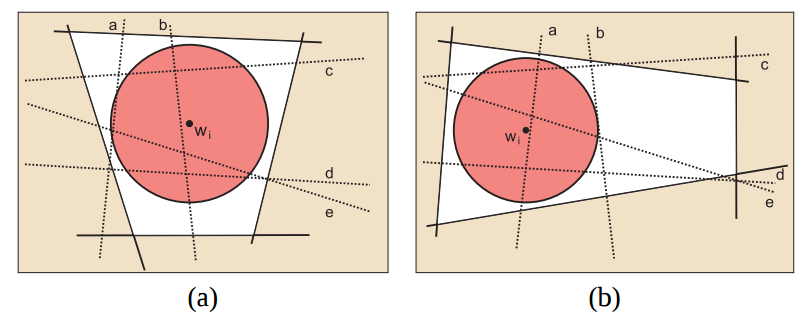
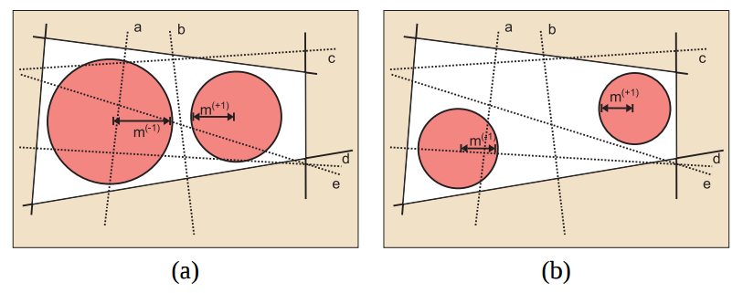

## Введение
Большинство задач машинного обучения, которые мы встречаем, относятся к обучению с учителем или без учителя. Рассмотрим задачу обучения с учителем.
В ней обучающему алгоритму подаются на вход некоторые *размеченные* тренировочные данные, то есть пары объекты-ответы $\{(x_i, y_i)\}_i \in X \times Y$. Затем по ним обучается *модель* --- параметрическое семейство функций $g(x, \theta): X \times \Theta \to Y$, и под *обучаться* понимается нахождение оптимального $\theta$, аргминимума функции потерь.
Такой подход, когда в обучении используются только исходные размеченные данные, относится к *пассивному обучению*.

*Активное обучение* решает задачи обучения с учителем, используя дополнительно *неразмеченные* данные, то есть объекты, для которых неизвестен ответ (класс, метка, значение целевой функции на этом объекте).

Предположим, что в нашей конкретной задаче обучения с учителем есть некоторая функция, которая сопоставляет ответ любому объекту из неразмеченных данных, но при этом является дорогостоящей процедурой (достаточно дорогой, чтобы не обращаться к ней постоянно). Будем называть ее *оракулом*. Тогда основная идея активного обучения --- выбирать объекты среди неразмеченных данных, которые помогут *быстрее обучить модель*, и тем самым минимизировать кол-во вызовов оракула.

*__Рис. 1: Схема активного обучения (семплирование из пула)__*

Активное обучение применяется в любой области, где построение обучающей выборки затратная процедура. Если вы занимаетесь классификацией текстов, изображений и т.п., найти неразмеченные данные не составляет труда.
Но готовые размеченные датасетами, которые подходят под вашу задачу, найти сложнее, приходится размечать самому, или просить друзей, или обращаться в специальные сервисы (Яндекс.Толока, Amazon Mechanical Turk). Друзей сильно мучить не хочется, а сервисам нужно платить, поэтому здесь пригодится активное обучение.

#### Почему это работает?
Прежде чем перейти к теоретическим аспектам, давайте рассмотрим два примера, демонстрирующих, почему имеет смысл выбирать объекты для разметки и построения обучающей выборки.

*__Пример 1.__*
Дана функция
$g(x, \theta) = \mathbb{I}_{x > \theta}(x),\, x \in [0, 1],\, \theta \in [0, 1]$, и нужно оценить $\theta$, при условии, что мы можем вычислять $g(x, \theta)$ в произвольных точках $x$, но процедура эта крайне дорогая, и кол-во вызовов хочется сделать как можно меньше.

Наивный подход --- взять для разметки равномерную сетку $\{i/n\},\, i = 1,\ldots, n - 1$. Оценка по времени этого решения --- $O(n)$ измерений.

*__Рис. 2: Задача линейного разделения. Наивный подход__*

Но быстрее эта задача решается двоичными поиском, временная сложность которого $O(\log n)$.

*__Рис. 3: Задача линейного разделения. Двоичный поиск__*

*__Пример 2.__*
Теперь рассмотрим пример, где сравниваются результаты классификации с помощью логистической регрессии и ее комбинации с активным обучением.

*__Рис. 4: Пример работы обычной логистической регрессии (b) и логистической регрессии с активным обучением (с)__*

На подграфике (a) изображены 400 точек, относящихся к одной из двух меток, сгенерированных из двух различных двумерных гауссовских распределений с одинаковой дисперисией (по 200 из каждого распределения).

На подграфике (b) изображена разделящая прямая, построенная логистической регрессией по 30 точкам, выбранных н.о.р. из пула всех данных. Точность классификации 70%.
На следующем графике изображена разделящая прямая, построенная логистической регрессией с активным обучением по 30 точкам, выбранных по степени неуверенности. Точность классификации 90%.

Это пример еще раз подтверждает, что для активного обучения нужно меньшее кол-во точек, чтобы обучится до приемлемой точности.

## Постановка задачи активного обучения
Обозначения:
- $x_i$ --- объекты, $y_i$ --- ответы (метки);
- $U = \{x_i\}_i$ (от *unlabeled*) --- неразмеченные данные;
- $L = \{(x_i, y_i)\}_i$ (от *labeled*) --- размеченные тренировочные данные.

**Задача**: обучить модель по размеченным данным $L_0$, имея возможность обращаться к оракулу, чтобы получать метки для неразмеченных данныx $U_0$.

**Вход**: размеченные данные $L_0$, максимальное число вызовов оракула $K$, неразмеченные данные $U_0$.

**Алгоритм**:
Обучить модель на $L_0$. Для $k = 0, 1, \ldots, K - 1$:
1. выбрать $x_{k + 1} \in U_k$;
2. узнать для него $y_{k + 1}$;
3. получить оптимальное $\theta_k$ на тренировочных данных $L_{k + 1} := L_{k} \cup \{(x_{k + 1}, y_{k + 1})\}$.

Таким образом, активное обучение --- это итерационный алгоритм, на каждой итерации которого к текущим тренировочным данным $L_{k}$ добавляется объект $x_j$ с меткой $y_j$, вычисленной с помощью оракула.

*__Замечание 1__*: Конечно, на каждой итерации можно (даже нужно, потому что обучение модели может быть недешевой операцией) запрашивать метки не для одного объекта $x_{k + 1}$, а для нескольких $\{x_{k + 1}^{(i)}\}_{i = 1}^{m}$ и дообучать модель на $L_{k} \cup \{(x_{k + 1}^{(i)}, y_{k + 1}^{(i)})\}_{i = 1}^{m}$.

*__Замечание 2__*: Как выбирать начальное множество $L_0$? Наивный способ --- равномерно из неразмеченных данных, а можно использовать специфику решаемой задачи. Например, для задач классификации предварительно сделать кластеризацию и взять центры кластеров.

## Стратегии выбора объектов для разметки

В активном обучении выделяют три типа источников неразмеченных данных:

- Семплирование из пула (pool-based sampling) --- есть некоторая коллекция неразмеченных данных, и из нее достаются объекты для запроса метки у оракула;

- Семплирование из потока (stream-based selective sampling) --- есть поток данных, в каждый момент времени доступен один объект, принимается решение, отобрать этот объект для разметки или нет;

- Генерация запросов (query sampling) --- обучающий алгоритм сам строит объекты для разметки.

Семплирование из коллекции наиболее встречающееся, и все перечисленные стратегии относятся к этому типу семплирования.

*__Замечание 3__*: Как упоминалось выше, основная идея активного обучения --- выбирать *наиболее информативные* (с учетом модели) объекты для разметки, чтобы кол-во вызовов оракула было минимально.
Все ниже перечисленные стратегии являются эвристиками, потому что понятие *"наиболее информативные"* нельзя полностью формализовать, результаты об оптимальности конкретной стратегии можно получить разве что в каком-то отдельном частном случае.

Далее будем считать, что мы находимся в условиях задачи классификации, но подобные варианты стратегий можно сформулировать и для задач регрессии.

Введем обозначение $\varphi_{\theta}(x)$ для функционала-эвристики, оценивающего прирост качества модели при добавлении $x$ к тренировочным данным, так что $x^* = \arg\max_{x \in U} \varphi_{\theta}(x)$ --- следующая точка для разметки;

#### Стратегия 1: выбор по степени неуверенности (uncertainty sampling)
Идея: давайте добавлять к тренировочным данным те объекты, в которых модель больше всего неуверена.

Пусть $P_{\theta}(y|x)$ --- апостериорная вероятность того, что $x$ относится к классу $y$.
В случае бинарной классификации с $y = 0, 1$ функционал-эвристику можно выбрать так
$\varphi_{\theta}(x) = -|P_{\theta}(y = 0|x) - 0.5|$. Другими словами, берем те $x$, которые модель $\theta$ относит к классу $0$ с вероятностью, наиболее близкой к $0.5$ (то есть вероятность, что $x$ в классе $1$ тоже близка к $0.5$).

В случае, когда классов больше, чем два:

a) $\varphi_{\theta}(x) = 1 - P_{\theta}(y^*|x)$, где $y^* = y^*(x)$ --- наиболее вероятный класс для $x$.
Максимизация этой величины по $x$ эквивалента $\min_x\max_{y\in Y} P_{\theta}(y|x)$. Только здесь не учитываются вероятности $P_{\theta}(y|x)$ на других метках, поэтому был предложен следующий подход.

b) $\varphi_{\theta}(x) = P_{\theta}(y^*_2|x) - P_{\theta}(y^*_1|x)$, где $y^*_i = y^*_i(x)$ --- $i$-й вероятный класс для $x$.
Здесь *минимизируется* зазор между двумя лучшими предсказаниями $y_1$ и $y_2$. Но если меток очень много, лучше использовать следующий функционал:

c) $\varphi_{\theta}(x) = - \sum_{y \in Y}  P_{\theta}(y|x) \log P_{\theta}(y|x)$ --- не что иное, как энтропия. Вспомните, что ее максимум достигается на равномерном распределении.

Ниже на тепловых картах сравниваются значения функционалов-эвристик a)-с) (обратите внимание, что тепловые шкалы на трех графиках разные).
Объекты, относительно которых модель больше всего неуверена, находятся в центре, так как для них все апостериорные вероятности $P_{\theta}(y_i|x)$ примерно равны. Объекты, находящиеся ближе к углам, считаются менее информативными, так как модель больше всего уверена в предсказанным для них меткам.

*__Рис. 5: Тепловые карты различных $\varphi_k(x)$ в случае трех классов. Синяя область --- наименее информативные объекты, красная область --- наиболее информативные объекты согласно данной стратегии__*

Форму области красного цвета на каждом графике легко объяснить  --- для a) она имеет форму треугольника, так как значение функционала определяется вероятностью $P_{\theta}(y^*|x)$, для b) область сосредоточена вдоль перпендикуляров от центра треугольника, так как она соответствует равенству $P_{\theta}(y^*_1|x)$ и $P_{\theta}(y^*_2|x)$. Что касается c), то в этом функционале учитываются все априорные вероятности, и если для точки $x$ вероятность $P_{\theta}(y|x)$ мала для некоторого $y$ (такие $x$ располагаются вдоль сторон), то эта точка не включатся в число информативных по стратегии c) (так как модель считает, что этот объект не относится к тому классу).

#### Стратегия 2: отбор комитетом (query by committee)

*Комитетом моделей* будем называть набор моделей, обученных на одном и том же множестве $L$. Обозначение ---
$C_L = \{\theta_1,\ldots,\theta_m\}$.
Идея стратегии: выбирать объекты с наибольшей *несогласованностью* комитетов моделей.

Пусть

- $V(y, x) = |{\theta \in  C_{L}: y_{\theta}(x) = y}|$ --- количество моделей из комитета $C_{L}$, выбравших $y$;

- $\hat{P}(y|x) = V(y, x) / |C_{L}|$ --- соответственно доля моделей, выбравших $y$.

Тогда несогласованность можно определить через
 $\varphi_{\theta}(x)  = - \sum_{y \in Y}  \hat{P}(y|x) \log \hat{P}(y|x)$ --- энтропию голосующей вероятности.

 Как уже говорилось, максимум энтропии достигается на равномерном распределении, значит, максимизация этого функционала соответсвует выбору объекта, для которого $V(y, x)$ примерно равны для каждого $y$.

#### Стратегия 3: Сокращение пространства решений (version space reduction)

Идея этого подхода заключается в уменьшении пространствами решений (version space). Под пространством решений в общем случае понимают множество гипотез, которые согласуются с текущими тренировочными данными. Понятие получается довольно размытое, но в задаче классификации гипотезы *связаны* с всевозможными разделяющими гиперплоскостями и т.п.

*__Рис. 6: Примеры пространств решений__*

Поскольку пространство решений это очень широкое понятие, то стратегии его уменьшения можно описать только на примере конкретной задачи. Ниже приведен пример, как комбинируется
SVM и активное обучение, и уменьшение пространства решений  его ключевая идея.

Стоит отметить, что отбор комитетом на самом деле тоже уменьшает пространство решений.

#### Стратегия 4: ожидаемое влияние на модель (expected model change)
Идея: будем искать такой объект, добавление которого в обучающее множество приведет к наибольшему *изменению* параметра модели $\theta$. Само изменение будем мерять с помощью нормы градиента функционала обучения $\ell_{\theta}(L)$, где $L$ --- обучающее множество.

Нам нужно посчитать влияние на модель, но мы не знаем метку на $x$ из неразмеченного множества $U$. Однако у нас есть апостриорное распределение $P_{\theta}(y|x)$, поэтому будем считать взвешенную сумму $\varphi_{\theta}(x)  = \sum_{y \in Y}  P_{\theta}(y|x) \cdot \| \nabla\ell_{\theta}(L \cup \{(x, y)\})\|$, другими словами, мат. ожидание нормы градиента.

Вспомните, что  $\nabla\ell_{\theta}(L) = 0$ ($\theta$ оптимум на обучающем множестве $L$), поэтому можно воспользоваться следующим приближением $\nabla\ell_{\theta}(L \cup \{(x, y)\}) \approx \nabla\ell_{\theta}(\{(x, y)\})$ для оптимизации вычислений.

#### Стратегия 5: ожидаемое уменьшение ошибки (expected error reduction)
Идея: максимизация уверенности на остальных объектах в неразмеченном множестве.

Пусть $\theta_+(x, y)$ --- оптимальный вектор параметров после дообучения модели на $L \cup \{(x, y)\}$, а $y^* = y^*(z)$ --- наиболее вероятный класс для $z$ в модели, обученной на $L$.

Рассмотрим функционал $\varphi_{\theta}(x)  = - \sum_{y \in Y}  P_{\theta}(y|x) \sum_{z \in U} (1 - P_{\theta_+(x, y)}(y^*|z))$, его максимизация соответствует минимизации $\sum_{y \in Y}  P_{\theta}(y|x) \sum_{z \in U} (1 - P_{\theta_+(x, y)}(y^*|z))$. То есть находим $x$, добавление которого увеличивает $P_{\theta_+(x, y)}(y^*|z))$ (делает как можно ближе к $1$) для всех неразмеченных $z$. Так как метку для $x$ мы не знаем, то делаем усреднение по всем $y$.

*__Замечание__*: В стратегиях выбор по степени неуверенности, отбор комитетом, ожидаемое влияние на модель к числу информативных объектов могут попасть аутлаеры. Поэтому их нужно исключить заранее, или рассмотривать не $\max_{x \in U} \varphi_{\theta}(x)$, а $\max_{x \in U} \varphi_{\theta}(x)\cdot \big(\frac{1}{|U|}\sum_{z \in U}\rho(x, z)\big)^{\beta}$, где $\rho$ --- это некоторая мера близости объектов, $\beta$ --- нормировочный коэффициент, чтобы контролировать величину весов. Последняя стратегия устойчива к выбросам.

## Активное обучение в SVM
Посмотрим, как активное обучение комбинируется с классическими методами классификации, таким как SVM. Описанный ниже метод относится к статье
[@TongKoller], краткий обзор других статей на эту тему можно найти в [@Settles].

Будем предполать, что:

- данные линейно разделимы (но подход можно адаптировать под допущение ограниченного кол-ва ошибок, применять kernel trick, как это сделано в SVM);

- класса два, их метки $1$ и $-1$.

#### Напоминание
В обычном SVM ищется классификатор вида $f(x) = {\rm sign}(\langle x, w \rangle - w_0)$ и решается оптимизационная задача
$\|w\|^2/2 \to \min_{w, w_0}$
при условиях $y_i(\langle x_i, w \rangle - w_0) \geq 1$, где
$w, w_0$ --- параметры алгоритма.

Величина $|\langle x_i, w \rangle - w_0|/\|w\|$ --- это расстояние от
точки $x_i$ до разделяющей гиперплоскости $\langle x, w \rangle - w_0 = 0$, поэтому когда минимизируется $\|w\|$, максимизируется зазор между *опорными* гиперплоскостями, которые проходят через ближайшие к разделяющей гиперплоскости $x_i$. Можно считать, что $\|w\| = 1$, тогда оптимизационную задачу можно переписать как
$\min_i y_i (\langle x_i, w \rangle - w_0)  \to \max_{w, w_0}$
при условиях $\|w\| = 1$ и $y_i(\langle x_i, w \rangle - w_0) \geq 1$.

#### О пространстве решений

По определению пространством решений будет являться
$\mathcal{V} = \{f |\, y_if(x_i) > 0,\, i = 1 \ldots n\}$.
Поскольку между $f$ и $w$ существует биекция, то можно считать, что
$\mathcal{V} = \{w\,|\, \|w\| = 1,\, y_i (\langle x_i, w \rangle - w_0) > 0,\, i = 1\ldots n \}$.

Обозначим за $Area(\mathcal{V})$ площадь пространства решений.

#### Теоретическое отступление, результат которого используется дальше
Если предположить, что $\|x_i\| = 1$, то $\min_i y_i(\langle x_i, w \rangle - w_0) = \min_i |\langle w, y_i x_i\rangle - y_i w_0| = \min_i |\langle w, y_i x_i\rangle - y_i w_0|/\|y_ix_i\|$, а значит зазор между гиперплоскостями также равен минимальному расстоянию от $w$ до гиперплоскости  $\langle v, y_i x_i\rangle - y_i w_0 = 0$ относительно $v$.

Отсюда следует, что оптимальный параметр $w$ --- это центр гиперсферы наибольшего радиуса в $\mathcal{V}$, которая бы не пересекалась ни с одной из гиперплоскостей полном пространстве.

*__Рис. 7: Активное обучение в SVM__*

#### Об активном обучении
Пусть также $\mathcal{V}_k^- = \mathcal{V}_k \cap \{w\,|\, \langle w, x\rangle < 0\}$ и  $\mathcal{V}_k^+ = \mathcal{V}_k \cap \{w\,|\, \langle w, x\rangle > 0\}$, где $\mathcal{V}_k$ --- это пространство решений после $k$ итераций активного обучения. Другими словами, $\mathcal{V}_k^-$ и $\mathcal{V}_k^+$ --- это пространства решений, если метка для $x$ оказалась $-1$ и $1$ соответсвенно.
Также за $\mathcal{V}_k(\ell)$ обозначим пространство решений после $k$ итераций активного обучения, который использует стратегию $\ell$.

В [@TongKoller] приводится лемма, говорящая о том, что оптимальной стратегий будет деление $Area(\mathcal{V})$ примерно пополам.
Точнее, если выбрать такую стратегию в активном обучении, которую условно обозначим за $\ell^*$, то для любой другой стратегии $\ell$ выполняется неравенство:
$$\sup_{P \in \mathcal{P}} {\rm E}_P[Area(\mathcal{V}_i(\ell^*))] \leq \sup_{P \in \mathcal{P}} {\rm E}_P[Area(\mathcal{V}_i(\ell^*))]$$
для любого $i \geq 1$, где $\mathcal{P}$ --- множество всех условных распределений $P(y|x)$.
При этом строгое неравенство достигается, если существует итерация $j \in 1,\ldots, i$, такая, что $\ell$  не делит пространство решений $\mathcal{V}_{j - 1}$ пополам.

Пусть $w_k$ --- центр гиперсферы наибольшего радиуса, которая вписана в пространство решений $\mathcal{V}_k$.
Предлагается три способа делить пространство решений так, чтобы площади полученных областей были примерно равны:

- *Simple Margin*.
Теперь перебирая все неразмеченные объекты $x$, выберем тот, для которого соответсвующая гиперплоскость ближе всего к центру $w_k$. По отступлению выше такой $x_k$ находится ближе всего к разделяющей гиперплоскости в пространстве объектов.

*__Рис. 8: Simple Margin. (a) выбирается ближайшая гиперплоскость b. (b) выбирается ближайшая гиперплоскость a__*

Обозначим за $m_k$ радиус гиперсферы.
Рассмотрим неразмеченный объект $x$, $\mathcal{V}_k^-$, $\mathcal{V}_k^+$ --- подпространства в пространсве решений, соответствующие отрицательной и положительной метке $x$. Теперь обозначим за $m^-_k$ и $m^+_k$ радиусы вписанных в $\mathcal{V}_k^-$ и $\mathcal{V}_k^+$ сфер.

- *MaxMin Margin*. Эта стратегия предлагает искать $\arg\max_x \min\{m^+_k, m^-_k\}$. Так как $m_k$ cвязан с $Area(\mathcal{V}_k)$, то на самом деле максимизируется $\min\{Area(\mathcal{V}_k^+), Area(\mathcal{V}^-_k)\}$, тогда $Area(\mathcal{V}_k^+)$ и $Area(\mathcal{V}^-_k)$ будут максимально близки.

- *Ratio Margin*. В этой стратегии ищется $\arg\max_x \min\{m^+/m^-, m^-/m^+\}$, она объясняется так же, как и стратегия MaxMin Margin.

*__Рис. 9: (a) MaxMin Margin --- выбирается гиперплоскость b. (b) Ratio Margin --- выбирается гиперплоскость e__*

## Недостатки активного обучения
Стратегии активного обучения устроены так, что они рекомендуют точки, лежащие, например, вблизи разделяющей гиперплоскости в текущей модели. Это хорошо работает, если нет крупных областей, где модель бы ошибалась. Таким образом, у алгоритма среди данных есть необследованные участки, что повышается ошибку на тестовых данных.

Возникает так называемая exploration-exploitation dilemma, но есть приемы, связанные с применением контекстных бандитов [см. @Bouneffouf1] и случайным изучением всего неразмеченного множества [см. @Bouneffouf2], которые не увеличивают время обучения так, что сама идея активного обучения теряет смысл.

## Литература
