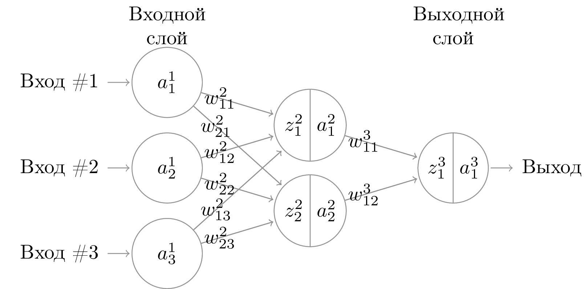

NB: всё далее изложенное -- черновик черновика текста доклада, здесь могут быть принципиально неверные утверждения и фактические ошибки.
План чистки:

1. Написать черновое содержание (весь текст, что есть в голове, всё “я придумаю, как сказать об этой формуле” -- придумать и записать сюда). По ходу отмечать, где не достаёт ссылок и точных формулировок и где возможны фактические неточности.
2. Пройтись по отметкам, найти ссылки, исправить формулировки и переписать текст с учётом новых данных. Проверить получившийся текст на связность, достаточность ссылок и точность формулировок. Если проверка не пройдена, перейти в 2.
3. Перечитать текст и склепать по нему презентацию.
4. Проверить презентацию на связность и внутреннюю логику. Если проверка не пройдена, перейти в 2.
5. PROFIT.

## [optional] Про мозг: передача информации путём активации нейронов.
Блаблабла, придумать текст

## Архитектура полносвязной сети и передача информации в ней.
Сначала поговорим про организацию нейросети как системы передачи информации. Идея в следующем: имеется вот такая картинка

Для каждого узла сети есть своя сумматорная функция $z$ и своя активационная функция $a$. На первом слое есть только активационная функция — $a_i(x) = x$. Входные данные подаются как аргументы активационных функций первого слоя. Обычно сумматорная функция в узлах — просто взвешенная сумма значений активационных функций узлов предыдущего слоя, связанных с этим. Значением, вычисленным нейронной сетью, считается вектор из значений активационных функций узлов последнего (выходного) слоя. То есть получаем «рекурсивно» определённую функцию: 

$$a^1_ i = \mathtt{input[}i\mathtt{]}$$
$$a^l_ i = a^l_ i(z^l_ i) = a^l_ i(\sum_ j w^l_ {ij} a^{l-1}_ j)$$ 

(здесь я уже подставила обычную суммирующую функцию). Активационная функция может быть какой угодно, обычно выбирается в зависимости от требований к области значений ответов: на внутренних слоях сигмоида, на наружных — сигмоида, арктангенс или ReLU. Почему такие — сейчас скажем.

Идея, стоящая за созданием нейронных сетей, заключается в том, чтобы промоделировать работу человеческого мозга. Очень общее и условное представление об устройстве и работе клетки человеческого мозга и легло в основу математической модели “нейронная сеть”.
Естественный нейрон в коре головного мозга, согласно этому представлению, выглядит следующим образом:

Клетка имеет множество разветвлённых отростков — дендритов, и одно длинное тонкое волокно — аксон, на конце которого находятся синапсы, примыкающие к дендритам других нервных клеток. Каждая нервная клетка может находиться в двух состояниях: обычном и возбуждённом. В возбуждённом состоянии клетка генерирует электрический импульс, который проходит по аксону до синапсов. Синапс при приходе импульса выделяет вещество, способствующее проникновению положительных зарядов внутрь соседней клетки. Синапсы имеют разную способность концентрировать это вещество, некоторые даже препятствуют его выделению — они называются тормозящими. Если суммарный заряд, попавший в клетку, превосходит некоторый порог, клетка возбуждается и генерирует импульс, который распространяется по аксону и доходит до синапсов, что способствует возбуждению следующих клеток. После возбуждения клетки наступает период релаксации — некоторое время она не способна генерировать новые импульсы. Благодаря этому клетки работают по тактам, наподобие дискретных автоматов, а сеть в целом передаёт направленную волну импульсов. [@Vorontsov2007]

Математическая модель естественного нейрона тогда выглядит следующим образом ( _модель МакКаллока-Питтса_):
$a(x_ 1, … x_ {n_ {l-1}}) = \mathrm{sign} (\sum x_ i + b)$, где $x_i$ — значения входов для этого нейрона.

Обобщая эту конструкцию, получаем систему, которую мы видели на первой картинке:
$$a^l_ i = a^l_ i \left(\sum_j w^l_ {ij} a^{l-1}_j\right)$$

### Нейронная сеть -- универсальный аппроксиматор
Давайте теперь детально поговорим о том, какие именно функции нейросеть теоретически может вычислить. [@Vorontsov2011]

Опр.: Набор функций $F \subset C(X)$ называется замкнутым относительно функции $\phi : \mathbb{R} \to \mathbb{R}$, если для любого $f \in F$ выполнено $\phi(f) \in F$. 

Т. [@Gorban1998]: Пусть $X$ — компактное пространство, $C(X)$ — алгебра непрерывных на $X$ вещественных функций, $F$ — линейное подпространство в $C(X)$, замкнутое относительно нелинейной непрерывной функции $\phi$, содержащее константу ($1 \in F$) и разделяющее точки множества $X$. Тогда $F$ плотно в $C(X)$. 

То есть для любой функции $g \in C(X)$ можно взять одну нелинейную $\phi$ и суперпозицией её линейных комбинаций (которой и является нейросеть, если у всех нейронов активационные функции одинаковы) приблизить $g$ с любой заданной точностью. Проблема только в том, что теорема не говорит, как именно это сделать

## Задача обучения сети

У нас есть некоторая функция $f: \mathbb{R}^N \to \mathbb{R}^k$, вида которой мы не знаем, а знаем только её значение на конечном наборе точек. Мы хотим построить её равномерное приближение.

Теорема Вейерштрасса: $\forall f: \mathbb{R}^n \to Q$, где $Q$ -- замкнутое ограниченное множество, $\forall \varepsilon > 0$ существует такой многочлен $P(x_1, \ldots, x_n):$
$$\mathrm{sup}_Q\left\vert f(x_1, \ldots, x_n) - P(x_1, \ldots, x_n) \right\vert < \varepsilon$$

Проблемы:

- признаковое пространство $\mathbb{R}^n$ может быть очень большой размерности
- а степень многочлена с повышением точности растёт
- проклятие размерности не оставляет нас

Будем строить приближение нейронной сетью с фиксированной архитектурой (тут важно заметить, что вообще-то от архитектуры сети зависит то, насколько хорошо мы сможем приблизить функцию, но перебор ещё и по архитектуре мы пока строить не будем). Функция, вычисляемая сетью при зафиксированной архитектуре сети, зависит только от множества её весов. То есть в общем случае мы приходим к задаче настройки весов сети, которая заключается в том, чтобы найти набор весов $$\{w_{ij}^l\} = \mathrm{arg\,min}_{\{w_{ij}^l\}} J\left(f, a\left(\left\{w_{ij}^l\right\}\right)\right),$$ где $J$ -- функция, измеряющая расстояние между $f$ и $a\left(\left\{w_{ij}^l\right\}\right)$.

Самый простой вариант функции $J$, который мы можем использовать -- MSE (тут непрятный вопрос, почему). Соответственно, задача настройки может быть переформулирована как задача минимизации значения целевой функции на заданном наборе входных данных.

Функция $f$ нам неизвестна, известен лишь набор её значений в некоторых точках (то бишь примеры входных данных и правильных ответов для них). Поэтому подгоняться веса сети будут так, чтобы приблизить значения функции в известных нам точках.

### Метод градиентного спуска
1. Имеется задача оптимизации: найти $\mathrm{arg\,min}_X F(x)$. Решение: возьмём какую-нибудь точку $x_0 \in X$ и пойдём в направлении наискорейшего спуска из этой точки $x_{n+1} = x_n - \lambda_n \nabla F(x_n)$
2. Прикидка идеи на сеть. Для того, чтобы сделать один шаг градиентного спуска, нужно посчитать производные целевой функции по всем весам сети.
Для среднеквадратичной ошибки в качестве целевой функции
$$J(\theta) = \frac{1}{2}\cdot\frac{1}{N}\sum_{k=1}^N \left\vert \hat y_k - y_k \right\vert ^2$$
производная будет выглядеть как 
$$\frac{\partial J}{\partial w_{ij}^l} = \frac{1}{N} \sum_{k=1}^N \sum_{i=1}^{n_L}\frac{\partial}{\partial w_{ij}^l} \left( \hat y_{ki} - y_{ki} \right),$$ то есть сумма производных для всех входов. То есть для одого шага градиентного спуска нужно пройти по всем данным. Данных может быть ОЧЕНЬ много, так что это не вариант.
3. Стохастический градиентный спуск: выбираем случайное подмножество наблюдений (как вариант, одно случайное наблюдение), считаем производную целевой функции для него и сдвигаемся в направлении антиградиента для этого конкретного наблюдения.
 Теорема: если градиент целевой функции ограничен, минус градиент в среднем указывает в сторону минимума и градиент не равен нулю не в точке оптимума, то стохастический градиентный спуск сойдётся к оптимальному значению. [@powell2007approximate]

Заметим, что "градиент не равен нулю не в точке оптимума" -- это очень сильное условие. Это означает, что никаких локальных минимумов/максимумов, никаких сёдел и уж тем более частично постоянных функций.

### Алгоритм обратного распространения ошибки

Самый важный вопрос: как считать-то этот градиент? Ответ: аналитически.

Пусть $J(\theta)$ -- наша целевая функция, значение которой на множестве примеров $\{x_i\}_{i=1}^N$ мы хотим минимизировать по множеству параметров $\theta$. Тогда для каждого параметра $w_ {ij}^l$ нужно посчитать 
$$\frac{\partial J}{\partial w_{ij}^l} = \frac{\partial J}{\partial a_i^l} \cdot \frac{\mathrm{d} a_i^l}{\mathrm{d} x} a^{l-1}_j.$$ Мы уже видим повторяющийся элемент $\frac{\partial J}{\partial a^l_i}$, но из чего же состоит он сам? Из $$\frac{\partial J}{\partial a^l_i} = \sum_{m=1}^{n_{l+1}} \frac{\partial J}{\partial a^{l+1}_m}\cdot\frac{\mathrm{d} a^{l+1}_m}{\mathrm{d} x} w^{l+1}_{mj}.$$ То есть для того, чтобы посчитать производные на следующем слое, достаточно производные на предыдущем слое (уже неизбежно подсчитанные) умножить на известные константы.

Изложенное выше не включает в себя векторизацию, после которой формулы становятся красивее, но которая утомительнее в выписывании.

Подробное изложение с векторизацией см. в [@Nielsen2015]

## Примеры неглубоких сетей

### Autoencoder

Пусть данные описываются векторами размера $N>>1$. Мы хотим получить их представление размерности $k$, для чего строим полносвязную нейронную сеть с одним внутренним слоем ширины $k$ и выходным слоем ширины $N$. После чего обучаем сеть на множестве примеров, у которых правильный ответ для примера равен самому примеру. Тогда когда мы остановим обучение сети, у нас будет представление наших данных в пространстве меньшей размерности. Причём качество этого представления мы сможем измерить. 

- как универсальный кодировщик эта идея не заходит, т.к. является репрезентативной только внутри поданной ей выборки, плохо обобщается
- хорошо заходит в качестве очищения от шума (всё равно мы не знаем, что в данных было шумом)
- использовалась для предобучения слоёв в глубинных сетях, но residual networks победили её всухую
- говорят, что учит фичи лучше, чем PCA

[tutorial with lots of info](https://blog.keras.io/building-autoencoders-in-keras.html) -- хорошее введение с примерами приложений и бесполезностей

### Word2Vec
[Efficient Estimation of Word Representations in Vector Space](https://arxiv.org/abs/1301.3781)

## Проблемы
Нейросети требовательны к объёму памяти и скорости вычислений, не очень хорошо параллелятся и т.д. 
При увеличении количества слоёв появляются проблемы с “размазыванием” градиента и с точностью вычислений.
Не все данные представимы конечным разумным числом входов (см. “Картинки с большим разрешением”, “текстовые последовательности”, считай требуемую память, умирай).
Не гарантируется скорость сходимости, поэтому хочется задавать априорную информацию о структуре взаимоотношений между входами.

## Решения

### Convolutional neural networks
[wiki](https://en.wikipedia.org/wiki/Convolutional_neural_network)
find proper literature and pictures

### Local vs. global optimization
what the hell does it mean and why did I write this?

### [optional] Recurrent neural networks

??? whatever else
