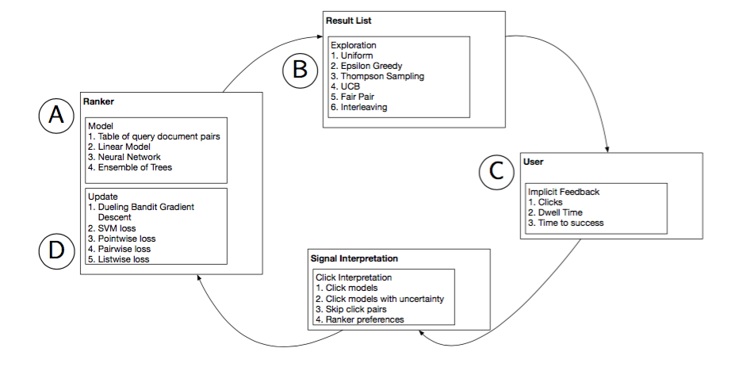
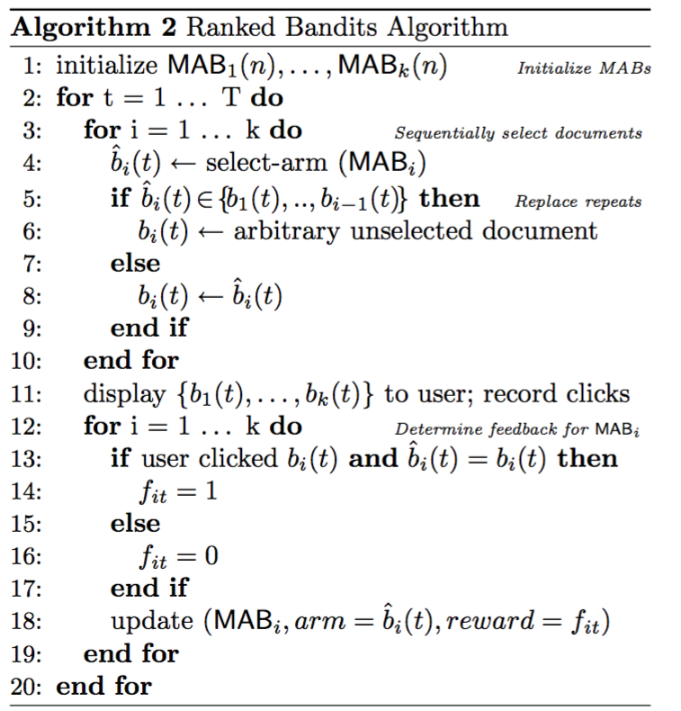
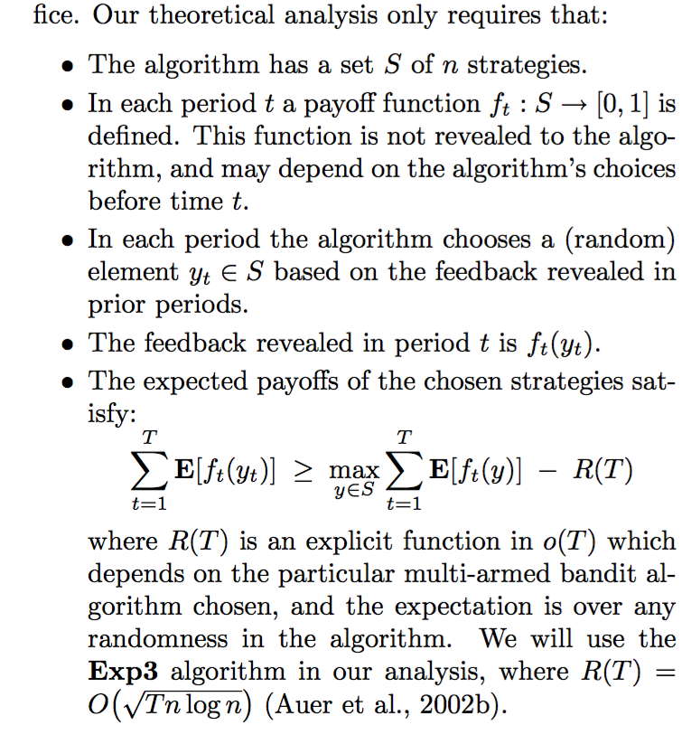
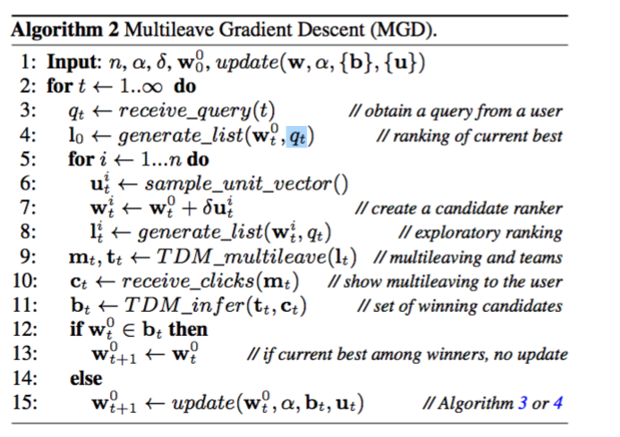
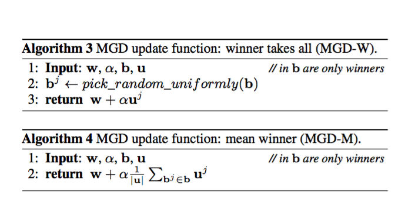

$$\DeclareMathOperator*{\argmax}{arg\,max}$$

#  Многорукие бандиты.

Рассмотрим следующую задачу: игрок приходит в казино, в котором стоит $n$ игровых автоматов (игровые автоматы (one slot machine) называют бандитами, отсюда и название),  у каждого из которых есть ручка, за которую можно «дернуть». Каждый «бандит» при дергании ручки дает какой-то выигрыш. Задача игрока — найти «лучшего» бандита и заработать как можно больше денег. 
Основная проблема игрока — он никогд не знает точно, какая же из ручек «оптимальна». Каждый раз, выберая ручку,  у него есть только информация о предыдущих испытания и две «базовые» стратегии — либо использовать тот автомат, от которого было больше всего пользы до этого — эксплуатирующая стратегия, либо некоторым образом пытаться использовать другие автоматы для того, чтобы понять, а не дадут ли они существенную пользу в будущем. Оптимальная стратегия игры — комбинация exploation и exploration (explotation-exploration tradeoff).

Существует несколько вариантов формализации задачи о многоруком бандите. Нас в первую очередь будут интересовать многорукие бандиты со случайным выигрышем (stochastic multi-armed bandits, smab). В  данной постановки выигрыш является случайной величиной, зависящей от «ручки». Другая популярная постановка задачи — adversarial bandits, в которых казино, на основе действий игрока, может менять выигрыши ручек. Первая постановка задачи близка к теории вероятностей и статистики, а вторая к теории игр.  

Рассмотрим формализацию задачи. У нас имеется множество ручек $A=\\\{a_i\\\}, 1 \leq i \leq k$. Задан дискретный поток времени $1, 2…$, в момент времени $t$ игрок выбирает ручку $a(t)$ и получает некоторый выигрыш $g_t = g_t(a(t)) = g_{a, t}$ (gain, reward, часто обозначают за $r$, но для того, чтобы не «путать» с regret будем обозначать буквой $g$). Ручки $a(t)$ выбираются игроком на основе некоторой стратегии (policy) — «функции» от истории. 

Цель игрока заключается в максимизации discounted cummulative reward за $T$ шагов:
$$G(T) = E\left( \sum\limits_{t=1}^{T} \lambda^{t}g_{t}\right), 0 < \lambda \leq 1 $$

В обычной постановке задачи $\lambda = 1$. В случае, когда $\lambda < 1$ ее можно трактовать как вероятность того, что после момента времени $t$ игра продолжится.

Достаточно часто от максимизации кумулятивного выигрыша переходя к минимизации потерь (regret):
$$\mu = \max\limits_{i = 1, … k}Eg(a_i)$$
$$R(T) = T\mu - E\sum\limits_{t = 1}^{T} g_{t},$$
где $g_{a_i}$ — выигрыш $i$-ой ручки, $\mu$ — «лучшая ручка», а параметр $\lambda$ мы считаем равным 1.
Или вводят случайные $r_t = r_t(a_t)$ (regret ручки) и сразу минимизируют 
$$R(T) = E\sum \limits_{i=1}^{T}r_{t}$$ 

Из определения потерь/выиграша видно, что для бейзлайн алгоритм (берущего случайную ручку) потери будет расти линейно.

Для такой постановки разработана обширная теоретическая база, доказываются upper/lower bounds на потери/выигрыш, предложены алгоритм, близкие или достигающие оптимальной границе (в зависимости от более точной формализации задачи).

### Варианты решения SMAB 

Для решения SMAB существует несколько основных алгоритмов. Обычно предполагается, что $0 \leq g(a) \leq 1$ (т.е. выигрыш ограничен).

В случае $\lambda < 1$ и байесовской постановки задачи (предполагаем, что для ручки — из параметрического семейства, для каждой ручки есть априорное распределение) можно показать (Gittins), что существует оптимальная стратегия игры (максимизирующая G(T), при этом не ассимптотически). Для каждой ручки надо вычислять так называемый dynamic allocation index (gittins index) и брать ручку с максимальным значением индекса. Сам алгоритм является некоторой вариацией динамического программирования и является очень трудоемким, из-за чего на практике его применять не получается. 

В связи с тем, что «оптимальный» алгоритм на практике не применим, используют другую технику — Upper confidence bounds (UCB).
Основная идея в том, что для каждой «ручки» $a$ в момент времени  $t$ есть некоторая оценка $\hat{\mu}(a)$ среднего выигрыша этой ручки. Пусть она построена по  $n_a(t)$ наблюдениям. Тогда предлагается построить для каждой ручки доверительный интервал (верхнюю границу) уровня $\delta(t)$:
$$ q(a) = \hat{\mu}(a) + \phi(\alpha, n_a(t), t)$$ 
И выберем ручку с максимальным значением q(a). $\alpha$ является параметром алгоритма, «регулирующем» exploration/explotation tradeoff.
Типичный пример:
$$q(a) = \hat{\mu}(a) + \sqrt{\frac{\alpha \log t}{n_a(t)}}$$

Видимо лучшей UCB на данный момент является KL-UCB, которая, в частности, для выигрышей, распределенных по бернулли, достигает нижней границы на потери (т.е. асимптотически опимальна). 
Для бернулли оптимально:
 $$\liminf \limits_{T \rightarrow \infty} \frac{ER(T)}{\log T} \geq C(\mu_1, …, \mu_k)$$ 

Помимо UCB для решения SMAB, в байесовской постановке SMAB, используют Thompson sampling.

Замечание: мы рассматривали ситуация, когда выигрыш стационарен. 

# Ранжирующие бандиты

### Постановка задачи

Для начала рассмотрим неформальное описание решаемой задачи. 

Есть некоторый поисковик/рекомендательная система/etc. В нее приходит пользователь и задает запрос $q$. Для каждого запроса есть множество документов $\mathbb{D} = \mathbb{D}(q)$. Требуется выбрать $k$ документов, показ которых удовлетворит пользователя (т.е. он найдет то, что искал). (документы, которые подходят под запрос называют релевантными).  

Цель поисковой системы — правильно отвечать на запросы пользователей. При этом, для конкретного пользователя система не знает, остался ли он доволен и имеет только неявный feedback о том, на какие документы и «как долго» кликал пользователь.

Требуется разработать систему, которая будет показывать «оптимальные» документы для пользователя. Различные формализация понятия «оптимально» приводят к различным алгоритмам.

Как видно, все очень похоже на то, что мы видели до этого:
1. Есть некоторый feedback о том, удачный ли мы результат показали пользователю
2. Можем жадно показывать документы с максимальным числом кликов на текущий момент
3. Можем пытаться искать новые документы, про кликабельность которых мы ничего не знаем

Мы рассмотрим 2 принципиально разных подхода к решению данной задачи.

### Сведения задачи к MAB/SMAB

Основные особенности первого семейства подходов, которые мы будем рассматривать:
1. Рассматриваем алгоритмы в рамках одного запроса. Для разных запросов — отдельные «экземпляры» алгоритма
2. В качестве ручки — список из $k$ документов, который показываем пользователю.
3. Сводим задачу к обычным MAB

Первый алгоритм, который мы рассмотрим — ranking bandtis by Radlinski. 
Решается следующая задача: есть множество документов $\mathbb{D}$ мощности $n$, есть некоторая «популяция» пользователей $U$. От ранжирующей системы требуется выдавать $k$ таких документов, что пользователь кликнет хотя бы на один из них (Цель — минимизация adandonment rate, т.е. кол-ва пользователей, которые ушли ни с чем).  

Одна из задач, которая решается рассмотренным далее алгоритмом — разнообразие выдачи. Существуют запросы, которые для разных пользователей означают разное. Например, на запрос «ягуар» один пользователь может иметь в виду животное, а другой автомобиль. Соответсвенно на выдачи надо показывать, с одной стороны, как можно более разнообразный набор документов, а с другой такой, что по нему будут «хорошо» кликать.

Рассмотрим следующую модель поведения пользователя:
1. Открываем страницу с выдачей
2. Смотрим на документы (точнее на snippets) по-порядку, начиная с первого.
3. Как только находим интересующий документ — кликаем и «уходим».

В момент времени $t$ к нам приходит пользователь $u_t$. Предполагаем, что пользователь характеризуется набором вероятностей $\\\{p_{t}(d)\\\}$, где $p_{t}(d)$ — вероятность пользователя кликнуть на документ $d$, если он до него дошел. 
Чуть позже нам потребуется «идеальный» кейс — ситуация, когда есть множество релевантных для пользователя $u_t$ документов $A = \\\{d_1, …, d_m\\\}$ и если пользователь его видит, то кликает с вероятностью 1.

Введем выигрыш: 
$$g_t(u_t) = \begin{cases}
    1, & \text{пользователь кликнул на какой-нибудь документ}.  \\
    0, & \text{иначе}.
  \end{cases}
$$

Пусть $a_t$ — список показанных в момент времени $t$ документов.

Будем максимизировать 
$$G(T) = E\sum\limits_{t=1}^{T} g_t(a_t, u_t)$$

Идея алгоритма  очень проста. 

Для каждой позиции $1…k$ в запросе вводится экземпляр бандитского алгоритма $MAB_{i}$. 

Для каждого пользователя будем действовать по следующей схеме:

Пусть $a_t[i], i = 1…k$ — показанный для $i$-ой позиции документ  в момент времени $t$

Для каждой позиции $i=1…k$ 
1. Выбераем с помощью $MAB_i$ документ.
2. Если документ встречается на $a_t[1], …, a_t[i-1]$, то заменяем его на случайный еще не выбранный документ
3. Показываем выбранный документ на позиции i (записываем в a_t[i])

После того, как по алгоритму выше сгенерирован $a$, показываем $a$ пользователю.
Пользователь кликает на какой-то документ, не умаляя общности будем считать, что это последний.

Тогда если документ на $k$ позиции не случайный, то $MAB_{k}$ получает выигрыш 1, иначе 0.
Все остальные документы получают выигрыш 0.

При некоторых предположения на алгоритм $MAB_i$ можно получть оценку на качество алгоритма за $T$ шагов:
$$G(T) = (1 - \frac{1}{e})OPT - O(k\sqrt{T\log n})$$

Здесь OPT — является оптимальным выигрышем для задачи в следующем смысле:

1. Рассматриваем идеальную ситуацию, когда $p_{ti}$ равны 0 или 1.
2. Множества релевантных документов для пользователей известны
3. Решаем задачу в оффлайн — по $u_1, …, u_{T}$ ищем такой набор документов, что $G(T)$ будет максимально (замечание: набор документов один на всех пользователей, а не лучший для каждого разумеется.)

Таким образом  для каждого документа есть набор пользователей, которые на него кликают. Итого есть $S_1, …, S_n$ множеств. Требуется выбрать из этих множеств $k$ так, чтобы $\cup S_i$ было максимальным (накрыть максимум пользователей)

Эта задачи $NP$-трудная.  OPT — оптимальное решение.

(1 - 1/e)OPT — жадное решение,  лучше которого сделать «нельзя» (или докажем какой-нибудь факт про  NP)

Вывод: в такой постановке алгоритм делате что-то полезное (на бесконечности «средний» выигрыш стремится к оптимальном, при этом скорость $\sqrt{T}$)

Еще замечание: 
1. «Бесплатно» получаем оптимальных бандитов и на префиксах из первых $l$ документов
2. Для доказательства оценки требуется выполнение некоторых условий на выигрыш для базового MAB-алгоритма. При этом для доказательства используется adversarial постановка задачи, про которую мы практически ничего не упоминали
3. В таком случае граница качества — worst case, т.е. что бы не происходило, будем не слишком плохие результаты показывать. В частности, выигрыш может быть нестационарным.
4. В статье использовали Exp3 алгоритм для базовых бандитов (он adversarial).
5.  Если интересы пользователей не меняются существенно со временем, то можно и нужно использовать алгоритмы на основе UCB, т.к. они, скорее всего, дадут «лучший» результат.

 
### Cascading bandits

Вводим больше ограничений в модель пользователя из прошлой задачи. 

Предполагаем, что  модель поведения пользователя на выдаче из $k$ документов следующая: 

1. Как и раньше, смотрим последовательно. 
2. Документы «притягивают» пользователя независимо друг от друга.
3. Для каждого документа задана вероятноть $p(d)$ (стационарная, не зависит от предыдущих просмотренных документов).
4. Кликает пользователь только на 1 документ

Из формулировки модели следует, что

1. Вероятность посмотреть на $d_i$ равна 
 $$\prod\limits_{j=1}^{i-1} \left(1 - p(d_j)\right)$$
2. Вероятность кликнуть хотя бы на 1 документ: $$1 - \prod\limits_{j=1}^{k} \left(1 - p(d_j)\right)$$
 
 Цель — выдать такой список документов, что вероятность того, что пользователь кликнет на какой-либо документ максимальна. 

За счет независимости выигрыш зависит только от $p(d_i)$ — «кликабельности» документа:
$$ \mu_i = p(a_t[i])$$
$$c_i = Ber(\mu_i)$$
$$g(a_t, u_t) = 1 - \prod\limits_{i=1}^{k}  (1 - c_i)$$
$$Eg(a_t, u_t) = 1 - \prod\limits_{i=1}^{k}(1 - \mu_i)$$

Как обычно определим потери как разницу между лучшим набором документов и тем, что показал пользователь.
$$R(T) = E\left(\sum\limits_{t=1}^{T} \left(g^{\*}(u_t) - g(a_t, u_t)\right)\right)$$
где $g^{\*}$ — алгоритм, показывающий всегда оптимальный набор документов (можно показать, что этот набор — документы с наибольшей вероятностью клика. Для тех, кому не очевидно — упражнение по теор. веру =)).

Алгоритм для такой постановки задачи предлагается следующий:

1. Выберем какой-нибудь UCB-like алгоритм. Рекомендуют KL-UCB, как наиболее точную.
2. Для каждого документа будем хранить кол-во раз, которое на него кликнули и кол-во раз, которое на него посмотрели
3. UCB будем вычислять для CTR — сколько раз кликнули при скольки просмотрах
4. На каждом шаге алгоритма — выбираем для показа $k$ документов с максимальными UCB
5. Для обновления UCB берем все документы до позиции последнего клика. Если пользователь не кликнул ни на один документ, то берем все документы. После этого все документы до позиции последнего клика считаем как просмотренные. На тот, который кликнул считаем и как кликнутый. Теперь с помощью UCB мы можем обновить статистики для этих документов (т.е. считаем, что «ручки», соответсвующие этим документам были сыграны)
 
Про данный алгоритм известно следующее:
1. $\liminf \frac{R(T)}{\log T} \geq C(k, n, p) $
2. Для KL-UCB и UCB1 $R(T) = O(n\log T)$, константы уменьшаются при увеличении $k$. Здесь $n$ в $O$ только для того, чтобы показать, что верхняя граница линейна по кол-во документов, из которых выбирают.

Стоит отметить, что авторы статьи получают результат, не зависящий от порядка, в котором показываются документы. Есть две стратегии того, как можно показывать топ $k$ документов по UCB:
1. По возрастанию UCB (первый — с самой низкой UCB)
2. По убыванию

С одной стороны, первый вариант «интуитивно» должен давать в будущем более точные оценки (позволяет «быстрее» узнать «полезную инфомрацию» про документы), с другой вариант 1 может раздрожать пользователей. На симулированных экспериментах вариант 1 был лучше, но почему авторы объяснить не смогли.

Замечание: есть обобщение данной модели на DCM модель, в которой пользователь может кликать на несколько документов:

## Dueling bandits

Второй вариант алгоритма основан на иной идее. Будем считать, что у нас есть некоторое нормированное векторное пространство $\mathbb{W}$, задающее ранжирующие алгоритмы. Т.е. $w \in \mathbb{W}$ является функцией от запроса и документа $w = w(d, q)$, выдающая значение «релевантности» документа запросу, по которой затем сортируются документы и берутся первые $k$.

 Будем считать, что умеем сравнивать 2 алгоритма: 
$$P(w_1 > w_2) = \frac{1}{2} + \varepsilon(w_1, w_2)$$

А также показывать пользователю одновременно выдачу, сформированную с помощью $w_1$ и $w_2$. 

Определим потери алгоритма за время $T$ как
$$ R(T) = \sum\limits_{t=1}^{T} \varepsilon(w^{\*}, w_1) + \varepsilon(w^{\*}, w_2), $$
где $w^{*}$ — лучший алгоритм ранжирования(которого мы не знаем)

Тогда для оптимизации таких потерь предлагается использовать следующий алгоритм:

При некоторых дополнительных предположения можно показать, что приведенный выше алгоритм действительно будет оптимизировать введенную нами функцию потерь:

1. Существует  диффиренцируемая строго выпуклая utility-functon на $\mathbb{W}$ :
 $$v : \mathbb{W} \rightarrow \mathbb{R}$$
2. Существует $\sigma$ такая, что 
$$P(w_1 > w_2) = \sigma(v(w_1) - v(w_2))$$
$$ \varepsilon(w_1, w_2) = \sigma(v(w_1) - v(w_2)) - \frac{1}{2}$$
Здесь $\sigma$ — link function. Типичный пример link function:
$$ \sigma(x) = \frac{1}{1 + e^{-x}}$$
3. $\sigma, v, \sigma^{\'}$  — липшицевы.
4. $\mathbb{W}$ содержим 0,  компактное, выпуклое, ограничено

Тогда доказывается следующий результат про $\Delta_{T} = R(T)$:

Здесь $R$ — радиус шара, в котором содержится $\mathbb{W}$, $L$ — константа липшица для $\varepsilon$ (равна $L_{v}L_{\sigma}$), $d$ — размерность $\mathbb{W}$

Замечание: в постановке считаем, что можем сравнить одновременно два алгоритма. Один из способов это сделать — TDI:

1. Смешиваем выдачи от двух разных ранкеров. 
2. Первый ранкер выбираем случайно
3. Каждый «ранкер» поочередно выбирает лучший документ из тех, что еще доступны
4. Добавляем документ в выдачу (на последнюю позицию), а выбранный документ записываем в «комманду» выбравшего его «ранкера»
5. Ранкер, по команде которого больше раз кликнули побеждает.

## Минусы рассмотренных подходов

В них практически никак не используется offline-алгоритмы, умеющие «хорошо» ранжировать документы (по сути некоторый prior на то, что есть хорошо и что есть плохо.). Кроме того, эти алгоритмы никак не умеют работать с контекстом — признаками, описывающими документы (и запросы). 

Кратко про то, как обучается формула для ранжирования. Для этого используется supervised learning подход с релевантностью, размеченной людьми и некоторым кол-вом признаков (фактор, features), на основе которых требуется предсказать релевантность документа запросу. 

Классическая схема обучения с учителем:

1. Собираем набор данных  (запрос, документ, релеватность). Для каждого запроса есть несколько документов.
2. Придумываем набор признаков, которые можем посчитать.
3. Обучаем GBDT под оптимизацию ранжирующей метрики (а точнее ее «гладкой» аппроксимации, но для нас это не суть важно).
4. Profit, afaik, state of the art качество.

Таким образом, для рассмотренных до этого бандита, обрабатывающего запрос, приходит не множество документов, а множество пар (doc, rel), где rel — некоторое число, отсортировав по которому есть шансы получить «хорошее» значение ранжирующей метрки.

### Offtop про идеи объединения подходов
«Идеи» подходов к объединению двух типов ранжирования:
1. С помощью supervised learning выдаем распределения релевантностей документов по факторам. Используем это распределение внутри бандитских алгоритмов
2. Формулу для ранжирования можно использовать в dueling bandits для начального подбора модели
3. Для некоторых простых классификаторов есть алгоритмы, позволяющие обучаться в online, а также confidence bounds на ошибку классификатора, которые также можно пытаться использовать
  
  

#OLD

# Введение. Многорукие бандиты.

Стандартная постановка задачи выглядит следующим образом: Дан набор «ручек». В момент времени $t \in \mathbb{N}$ игрок дергает одну из «ручек» и получает выигрыш (reward) $x_t$. От игрока требуется максимизировать (дисконтируемое) мат. ожидания выигрыша за $T$ шагов:
$$\max \sum_{t=1}^{T} \lambda^{t}Ex_t$$
где мат. ожидание берется по всему случайному, что только может быть. Параметр $\lambda$ можно трактовать, как вероятность того, что игра не закончится на следующем шаге. Соответсвенно стратегией называется алгоритм, по которому надо дергать ручки. При формализации задачи достаточно часто от максимизиции выигрыша переходят к минимизации потерь — разницы между максимальным возможным выигрышем и выигрышем, который можно получить в результате выбранной стратегии. 

Для «игры» в такой системе рассматривают следующие 2 типа стратегий:
1. Expolration (эксперементирования) — дергаем «относительно случайные» ручки, чтобы лучше узнать поведение системы в целом
2. Explotation (эксплуатирование) — дергаем ручку, которая до этого давала максимум пользы.

Большая часть алгоритмов пытается сочетать две предыдущие стратегии таким образом, чтобы в будущем получить максимальную пользу. 

 Рассмотренная постановка задачи наиболее общая и в дальнейшем вводятся дополнительные предположения о выигрыше. Рассмотрим несколько более формальных постановок задачи.

 Основная особенность — фидбэк получаем «сразу после» дергания ручку

По выигрышу бандитов можно разделить на несколько «основных» типов бандитов — stochastic, adversarial rewards.
В первом случае случае выигрыш — случайный процесс, не зависящий от игрока
Во втором — есть опонент, который подбирает ручки так, чтобы нам насолить. Данный вариант ближе к теории игр и случайным стратегиям, и мы на нем останавливаться не будем. Стоит отметить, что алгоритмы для второй постановки задачи имеют преимущество надо стандартной stochastic постановкой (когда rewards iid) — выигрыш может меняться со временем, например, из-за изменений предпочтений пользователя (т.е. нам не важна стационарность). Т.к. во втором варианте для регрета рассматривают оценки в «худшем» случае, то и нестационарность они переживают. 

## Stochastic bandits.

 Как и до этого, у нас есть $k$ ручек. Для каждой ручки в момент $t$ задан выигрыш $X_{i, t}$ . В момент времени $t$ игрок выбирает ручку $I(t)$.
 Определим потери для последовательности ручек $I(1), …, I(T)$ как 
 $$R(T) = \max_{i = 1, …, K} \sum \limits_{t = 1}^{T} X_{i, t} - \sum \limits_{t=1}^{T} X_{I(t), t}$$

В стандратной постановке задачи предполагается, что  распределение $X_{i, t}$ — стационарны:
$$ X_{i, t} \sim \mathbb{P_i}, X_{i, t} — i.i.d.$$
$$\mu_i = EX_{i}$$
$$ \mu = \max \mu_i$$
После чего формальная задача: минимизировать среднии потери:
$$\overline{R}(T) = \max_{i} E\sum X_{i, t} - E\sum X_{I(t), t} = T \mu - E \sum_{t = 1}^{T} \mu_{I(t)}$$

Таким образом, для такой задачи, возникают следующие теоретические вопросы (при $T \rightarrow \infty$):

1. Нижние оценки на потери, которые в принципе может получить любой     алгоритм.
2. Алгоритм с верхними оценками на потери. В идеале — доказываем, что для какого-то алгоритма верхнии и нижнии оценки совпадают
     
Семейство алгоритмов, достагающих нижней грнаиц — UCB (Upper confidence bounds)
### UCB
<!-- Ну умаляя общности предположим, что все $X_{i} \in [0, 1]$. -->
 Идея алгоритмов очень простая – для каждой ручки мы знаем, сколько раз ее дернули и какой за это был reward. Давайте для каждой ручки построим доверительный интервал. На каждом шаге будем выбирать ручку, у которой верхняя граница доверительного интервала максимальна (т.е. та, которая, в некотором смысле, дает надежды на максимальный выигрыш в будущем).

Пусть до текущего момента времени ручку $i$ дернули $n_i$ раз. Пусть $\hat{mu}_i$ — текущее выборочное среднее для $i$-ой ручки Тогда на следующем шаге дергаем ручку, дающую максимум следующей величине:
$$ \mu_i + \sqrt{\frac{\alpha \log t}{n_i}}$$

Есть куча литературы  с верхними и нижними оценками на регрет. 
Большая часть статей про бандитов без док-ва какой-нибудь оценки не обходится.

##### KL-UCB

Достаточно знать, что такое есть и дает более точные доверительные интервалы для близких к 0/1 случайных величин с распределением бернулли.

##Contextual bandits
Введем $\mathbb{C}$ — множество контекстов.
$$(x, r) \sim P$$
Здесь $r$ вектор выигрышей для ручек, где $r_i$ — выигрыш $i$-ой ручки.

Вводим контекст.

## Другие стратегии игр
### $\varepsilon$-жадная

Простая эвристическая идея. Зафиксируем $\varepsilon \in [0,1]$. На каждом шаге будем с вероятностью $\varepsilon$ выбирать случайную ручку и с вероятностью $1 - \varepsilon$ лучшиую на данный момент ручку.

### Thompson sampling

Зададим множество контекстов $\mathbb{C}$, множество «ручек» обозначим за $\mathbb{A}$ . Будем считать, что выигрыш — случайная величина, зависящая от контекста и ручки, с параметрическим распределением $P(r|\theta, a, c)$.
Введем следующие обозначения:
1. Априорное распределение на параметр $\theta$ — $\pi(\theta)$
2. $\mathbb{D}$ — «история» — множество наблюдаемых троек $\{(c, a, r\}$

Тогда мы можем вычислить апостериорное распределение параметра $\theta$:
$$ P(\theta | \mathbb{D}) = \frac{P(\mathbb{D}|\theta) \pi(\theta)}{P(\mathbb{D})}$$

Далее выбираем ручку, у которая наибольшая вероятность дать максимумальный профит:
$$ \int \limits_{E(r | a, x, \theta) = \max_\limits{\overline{a}} E(r | \overline{a}, x, \theta)}P(\theta | \mathbb{D}) d\theta$$ 

Интеграл считать дорого и поэтому его аппроксимируют сэмплированием.

# Ранжирующие бандиты

### Мотивация. Offline ранжирование

Используем supervised learning:
1. Собираем набор данных  (запрос, документ, релеватность)
2. Придумаываем набор признаков, которые можем посчитать
3. Обучаем GBDT под оптимизацию ранжирующей метрики (а точнее ее «гладкой» аппроксимации, но для нас это не суть важно)
4. Profit (AFAIK, state of the art)

Проблема — надо размечать документы людьми, нужно много данных, модельки устаревают, разметка ассесорами может отличаться от пользователей.

##Неформальная задача.

Дан запрос $q$. Для этого запроса есть набор документов $\mathbb{D}$. Хотим выбирать $l$ документов из $\mathbb{D}$ для показа пользователю. 
Цель — счастье пользователей. 
Померить счастье — сложно, будем считать клики:
Если пользователь не кликнул ни на один документ, то все плохо и моделька получает 0 gain
Иначе все хорошо — даем много gain

Как с бандитами связано:
1) С одной стороны — хотим выдавать лучший список, который только можно прямо сейчас (explotation) — давайте возьмем топ по кликам
2) С другой – надо бы что-то узнавать о документах, про клики на которые мы ничего не знаем
3) Живем в онлайн — после показа выдачи, можем обновить алгоритм

Их Grotov tutorial:

План: рассмотрим несколько подходов к тому, как можно решать задачу.

Отличия от reinforcment learning: часто ревард не явный (только что лучше)
Отличия от supervised: нет разметки, онлайн, etc

### Про обозначения
1) Можно свести все к одному типу обозначений — с одной стороны удобнее, с другой — все алгоритмы прийдется переписать, а потом при открытии статьи переводить обратно.
2) Придерживаться тех, что в соответсвующей статье — при необходимости не придется разбираться, как поменять буквы

##Diverse rankings by Radlinski

 diverse rankings – документы, релеевантные запросы при различных значения запросах/пользователях  
Решение (Maximal Marginal Relevance): зададим функцию релевантность $f(d, q)$ и меру схожести документов $g(d_1, d_2)$ и будем 
выбирать документы по следующему принципу:

$$\argmax\limits_{d \in \mathbb{D}} \lambda f(d,q) - (1-\lambda) \max_{d_2 \in S} g(d, d_2)$$
где $S$ — множество уже выбранных документов.

Подход 1: подбираем $f$, $g$, затем деаем $MMR$
Подход 2: подбираемся в онлайне по кликам

Рассмотрим модель для 1 запроса. 
Обозначения:
Множество $\mathbb{D}$ — набор документов для запроса $|\mathbb{D}| = n$
Показываем $k$ документв. 
В момент времени $t$ к нам приходит пользователь $u_t$. Параметр пользователя — вектор $p_{ti}$, где $p_ti$ — вероятность того, что $u_t$  кликнет на $i$ документ из $\mathbb{D}$ (при условии, что он досмотрел до этого документа)
Payoff: 1 если кликнул, 0 иначе.

adandonment — юзер ни куда не кликнул

Формально: 
Дано множество документов $\mathbb{D} = \{ d_1, …, d_n\}$
Есть множество пользователей $\mathbb{U}$
Для каждого пользователя $u_t$ задан $A_t \subset D$ — набор релевантных документов для этого запроса
Для пользователя $u_t$ задан вектор вероятностей $p_{ti}, i \in \mathbb{D}$, характеризующий пользователя (user type)
(Идеал $p_{ti}$ либо 0, либо 1 — пользовател на документ либо всегда кликает, либо всегда пропускает)
Выигрыш: 1 если пользователь кликнет хотя бы на 1 документ, 0 иначе
Минимизируем abandonment — кол-во пользователей, ушедших от нас

Предложено 2 алгоритма — жадный и бандиты, мы будем только про бандитов говорить.

Ranked bandits algorithm
Идея: на «серпе» k позиций. 
Заведем $k$ бандитов $b_1, … b_k$, каждый отвечает за документ на $i$-ой позиции.
На каждом пользователе: 
каждый бандит выбирает документ.
Идем по порядку, если документ был до этого — заменяем на случайный не выбранный еще документ.
показываем пользователю и собираем клики.
для бандитов, которые выбрали кликнутый (и не случайный) документ — выдаем reward 1
остальным 0
В качетсве работающего алгоритма берем любой бандитский алгоритм (обзор про бандитов вообще до этого…)
Алгоритм: 

Комментарии: 
в статье проводят анализ качества за T шагов по сравнению с «оптимальной полиномиальной аппроксимацией»

Условия на бандитский алгоритм:

Качество алгоритма за T шагов:
$$(1 - \frac{1}{e})OPT - O\left(k\sqrt{Tn\log n}\right)$$
OPT - «оптимальный» оффлайн алгоритм
Что такое оптимально:
offline
пусть $p_{ti}$, определенный до этого равны 0 или 1.
Тогда для каждого документа есть набор пользователей, которые на него кликают.
Итого есть $S_1, …, S_n$ множеств.
Требуется выбрать из этих множеств $k$ так, чтобы 
$\cup S_i$ было максимальным (накрыть максимум пользователей)
Эта задачи $NP$-трудная. 
OPT — оптимальное решение
(1 - 1/e)OPT — жадное решение,  лучше которого сделать «нельзя» (или докажем какой-нибудь факт про  NP)

Вывод: в такой постановке алгоритм делате что-то полезное (на бесконечности «средний» выигрыш стремится к оптимальном, при этом скорость $\sqrt{T}$)

Еще замечание: 
«Бесплатно» получаем оптимальных бандитов и на префиксах из первых $k^{\'}$ документов
Граница качества — worst case

Нету исследования на реальных пользователях, только симмулированный эксперемент.

### Cascading bandits

Вводим больше ограничений в прошлую модель. Рассматриваем каскадную модель поведения пользователя.

Предполагаем, что пользователь ведет себя следующим образом:
Как и раньше надо выбрать $k$ документов из $n$, чтобы показать пользователю.  
Существенно упрощение задачи — считаем, что для каждого документа задана вероятность $w(d)$ того, что пользователь кликнет на данный документ. 
При этом предполагается, что кликает он независимо от других документов, которые видел. 
Кликает пользователь только на 1 документ. 

Отсюда если хотим показать $(d_1, …, d_k)$, то
1. Вероятность посмотреть на $d_i$ равна $\prod\limits_{j=1}^{i-1} \left(1 - w(d_j)\right)$
2. Вероятность найти что-нибудь полезное: $1 - \prod\limits_{j=1}^{k} \left(1 - w(d_j)\right)$
 
 Цель — выдать такой список документов, что вероятность того, что пользователь найдет что-то полезное максимальна.

 Модель никак не учитывает порядок и решения – взять документы с максимальными $w(d)$

Регрет: разница между attration probability оптмиального листа и того, что мы показали. 
Как обычно минимизируем кумулятивный регрет
Сам алгоритм очень простой: берем бандитский алгоритм (в статье рассматривают UCB и KL-UCB). 
На каждом шаге выбираем документы для показа с максимальным UCB
Обновление: за счет cascading, узнаем сразу «много» про документы:
Будем считать, что пользователь кликнул на документ $m$. 
Тогда мы знаем, что $d_1, … d_{m-1}$ «плохие»
$d_{m}$ хороший.
Обновляем для $d_1, d_{m-1}$ статистики по кол-во просмотров и кликов для
$d_1, …, d_{m$}, а $d_{m+1}…d_{k}$ не трогаем.

В статье для желающих  можно найти доказательство того, что регрет за $T$ шагов будет $O(n\log(T))$
Здесь $n$ в $O$ только для того, чтобы показать, что верхняя граница линейна по кол-во документов, из которых выбирают.
Кроме того, из полученных оценок следует, что регрет будет уменьшатсья при увеличении $K$ (в предыдущем алгоритме при увеличении $k$ становилось только хуже, но там немного другая постановка и худший случай)

Замечание: док-ва игнорируют порядок, в котором показываются документы. Интуитивно — для «быстрого обучения» хорошо бы сначала показывать документы с низкими UCB, а затем с высоким, а для счастья пользователя — наоборот.

###DCM Bandits: Learning to Rank with Multiple Clicks

Работа от авторов предыдущего алгоритма. Меняют модель кликов и адаптируют алгоритм под нее, опять доказывают границы на regret. Обобщение предыдушего результата.

### Some "black magic"
Предыдущие алгоритмы относительно простые и с теор. гарантиями. В тоже время они не умеют учитывать контекст.
Эта проблема «легко» решается — меняем наивное среднее по каждому документы на 
$f(d, c, u)$, где $d$ — документы, $c$ — контекст, $u$ - какая-то информация о пользователе. 
В качестве $f$ берем некоторый классификатор (gbdt, neural network, svm). 
Далее 2 варианта развития событий:
1. Не задумываемся и оставляем $UCB$ в том виде, в котором она была представлена для обычного алгоритма
2. Ищем статьи с дов. интервалами для вашего классификатора и используем их.  

## Dueling bandits

Зададим подпространстов $\mathbb{W}$ ранжирующих алгоритмов, содержащееся внекотором  метрическом пространстве. 

Note: у нас бесконечное кол-во ручек.
Хотим найти $w \in \mathbb{W}$, «нравящийся» максимальному кол-ву пользователю.

Будем считать, что умеем сравнивать 2 алгоритма: 
$$P(w_1 > w_2) = \frac{1}{2} + \varepsilon(w_1, w_2)$$

Алгоритм будет в каждый момент времени $t$ выбирать 2 элемента $\mathbb{W}$

Определим качество алгоритма за время $T$ как
$$ \Delta_{T} = \sum\limits_{t=1}^{T} \varepsilon(w^{\*}, w_1) + \varepsilon(w^{\*}, w_2)$$
Здесь $w^{*}$ — лучший алгоритм (которого мы не знаем)

 Предположения:
 Существует  диффиренцируемая строго выпуклая utility-functon, задающая качество элементов $\mathbb{W}$ :
 $$v : \mathbb{W} \rightarrow \mathbb{R}$$

и определим:
 $$P(w_1 > w_2) = \sigma(v(w_1) - v(w_2))$$
Или, что тоже самое:
$$ \varepsilon(w_1, w_2) = \sigma(v(w_1) - v(w_2)) - \frac{1}{2}$$

Здесь $\sigma$ — link function. Типичный пример link function:
$$ \sigma(x) = \frac{1}{1 + e^{-x}}$$

Для теор. анализа вводятся еще следующий ограничения: 
$\sigma, v, \sigma^{\'}$  — липшицевы. 
$\mathbb{W}$ содержим 0,  компактное, выпуклое, ограниченное. 

Тогда доказывается следующий результат про $\Delta_{T}$:

Здесь $R$ — радиус шара, в котором содержится $\mathbb{W}$
$L$ — константа липшица для $\varepsilon$ (равна $L_{v}L_{\sigma}$) 

Замечание: в постановке считаем, что можем сравнить одновременно два алгоритма. **TDI**Смешиваем выдачи от двух разных ранкеров. Выбираем первый ранкер случайно, затем каждый поочередно выбирают лучшего по их мнению из оставшихся. Получаем «команду», по кому больше кликнули — тот и «победил»

## MGD

Обобщение предыдущего (2016 год)

